# Replay

**Will this change to my model, prompt or retrieval make my LLM app better or worse, and by how much?**

Replay captures production traces from LLM apps and agents, replays them against a candidate change,
scores both sides with an LLM judge you have checked against human labels, and returns a verdict you
can defend: **SAFE**, **UNSAFE** or **INCONCLUSIVE**, with confidence intervals. It can block pull
requests that make things significantly worse.

## Contents

1. [Why Replay](#why-replay)
2. [How it works](#how-it-works)
3. [Architecture](#architecture)
4. [Core concepts](#core-concepts)
5. [Run it locally](#run-it-locally)
6. [Send your first trace](#send-your-first-trace)
7. [Gate pull requests in CI](#gate-pull-requests-in-ci)
8. [Configuration](#configuration)
9. [Tests](#tests)
10. [Repository layout](#repository-layout)
11. [Deployment](#deployment)
12. [Status](#status)
13. [Documentation](#documentation)

---

## Why Replay

Changing a prompt, swapping a model or tuning retrieval is easy. Knowing whether it made the product
worse is not. Eyeballing a handful of outputs misses regressions; a one-number "score went up" hides
noise. Replay answers the question the way a clinical trial would:

- **Real inputs.** It uses your own production traces, not synthetic prompts.
- **Paired comparison.** Every trace is run under both the baseline and the candidate, so the
  comparison is within items.
- **A judge you have audited.** Judge-vs-human agreement (Cohen's κ), position bias and length bias are
  shown on every report.
- **A decision rule, not a vibe.** The verdict is a confidence interval compared against a
  non-inferiority margin. When the data cannot support a call, Replay says INCONCLUSIVE and estimates
  how many more items would settle it.
- **Safe by construction.** Tool and retrieval results always come from the recording, so replay never
  runs your code or touches outside systems. LLM calls use *your* provider keys.

## How it works

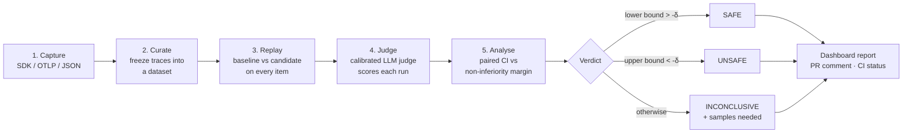

A typical lifecycle, from a developer's point of view:

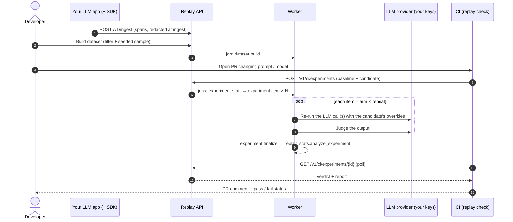

## Architecture

### System context

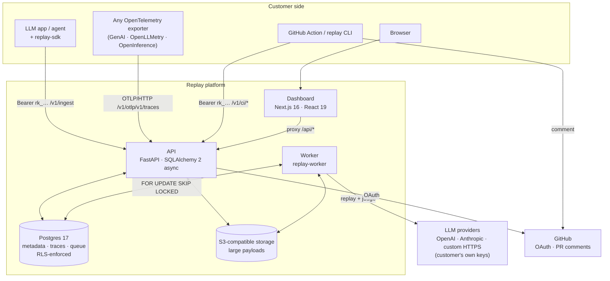

There are two public hosts: `app.<domain>` (dashboard) and `api.<domain>` (SDK, OTLP, CI). The
dashboard talks only to the API; the worker is never exposed.

### Components

| Component | Tech | Responsibility |
|---|---|---|
| **API** (`backend/`) | FastAPI, SQLAlchemy 2 async + asyncpg, Alembic | Auth, ingest, OTLP, datasets, judges, experiments, CI endpoints, quotas, audit |
| **Worker** (`backend/.../worker`) | Python, Postgres-backed queue | Dataset builds, replays, judging, finalisation, retention sweeps, org deletion |
| **Replay engine** (`backend/.../replay`) | Python | Canonical formats, recording builder, tool-call matching, providers, judging |
| **Stats library** (`packages/stats`) | Pure Python, no I/O | Intervals, significance tests, agreement, power, verdict |
| **SDK** (`packages/sdk-python`) | Zero dependencies | Capture; never blocks and never raises |
| **CLI / Action** (`packages/cli`, `action/`) | Standard library only | Run an experiment from CI and turn the verdict into an exit code |
| **Dashboard** (`web/`) | Next.js App Router, Tailwind | All user-facing pages |
| **Postgres** | 17 | System of record *and* job queue |
| **Object storage** | S3 API (SeaweedFS locally) | Span payloads over 32 KB, large dataset recordings |

### Backend layering

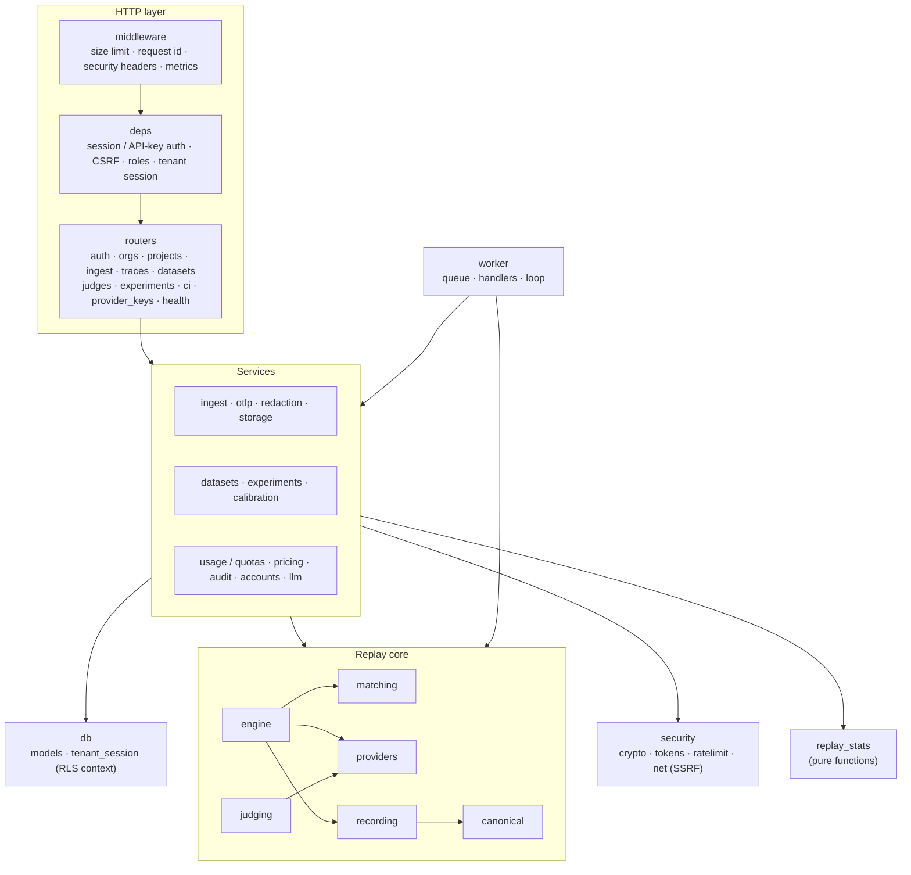

The API and worker share the same services and database layer; only the entry point differs. Replay core
and `replay_stats` have no HTTP or ORM knowledge, which is what makes them directly testable.

### Request paths

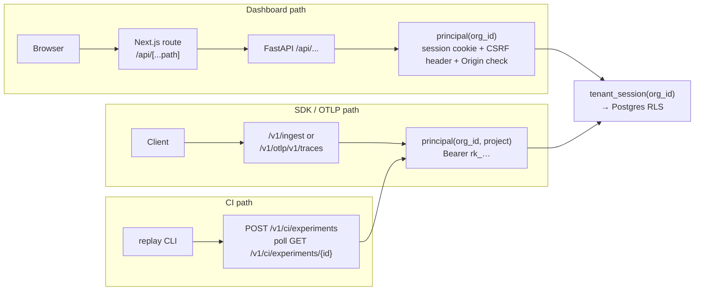

Ingest is a pipeline: validate → check quota (new traces only) → redact → offload large payloads →
upsert traces (row locks serialise concurrent batches) → upsert spans → recompute trace aggregates.
Re-sending a span is safe.

### Experiment pipeline (worker)

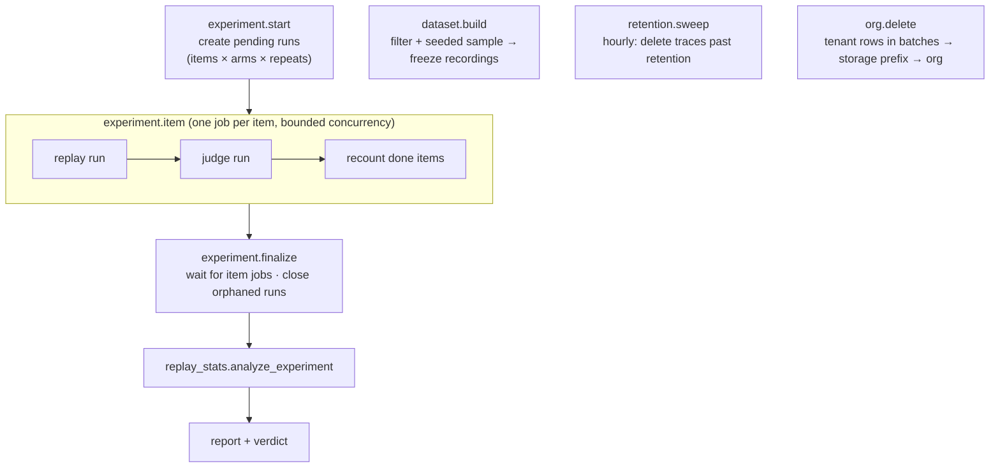

Queue semantics (Postgres, no extra broker):

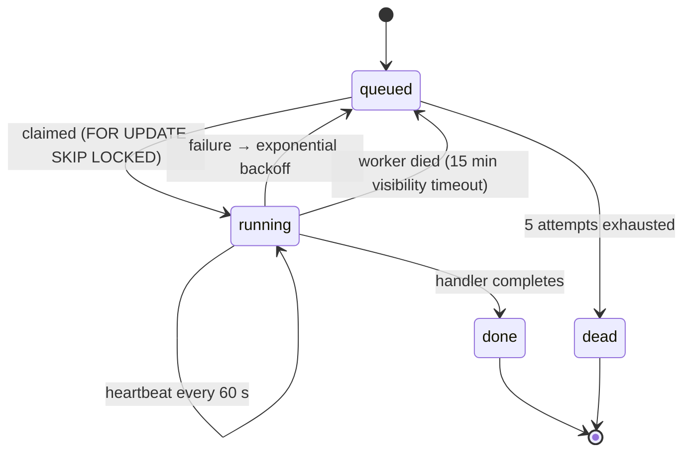

Handlers are idempotent: finished runs are skipped on retry, and judgments are keyed by run or by
(repeat, order).

### Tenant isolation: enforced twice

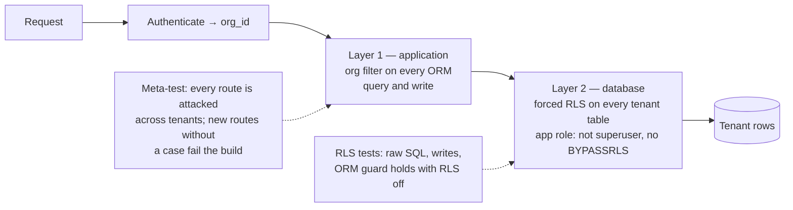

A bug in one layer is caught by the other. See [DECISIONS 004](DECISIONS.md) and
[docs/security.md](docs/security.md).

### Data model

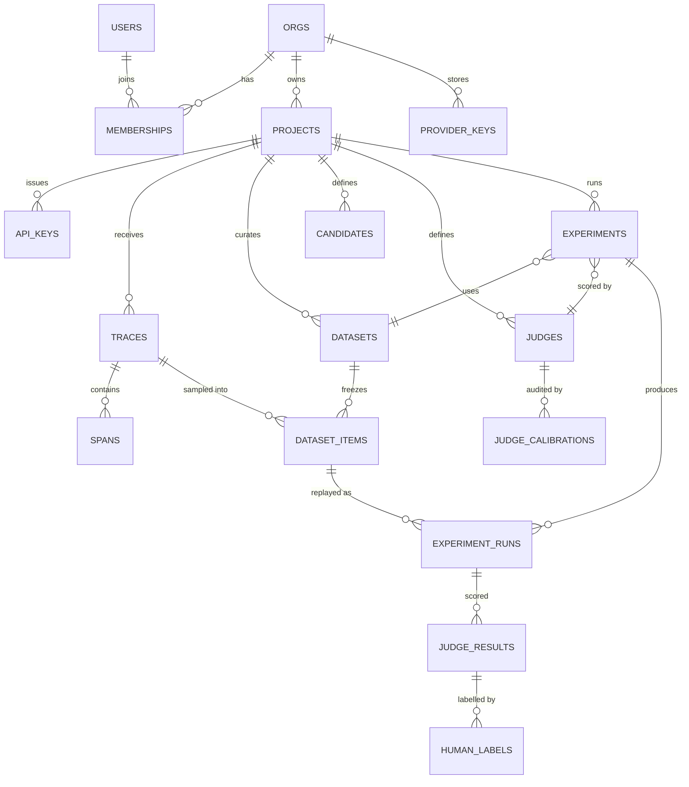

Supporting tables: `invites`, `sessions`, `audit_log`, `usage_counters`, `jobs`, `cron_state`. Every
tenant table carries `org_id`, an index on it, and a forced RLS policy.

### Deployment topology

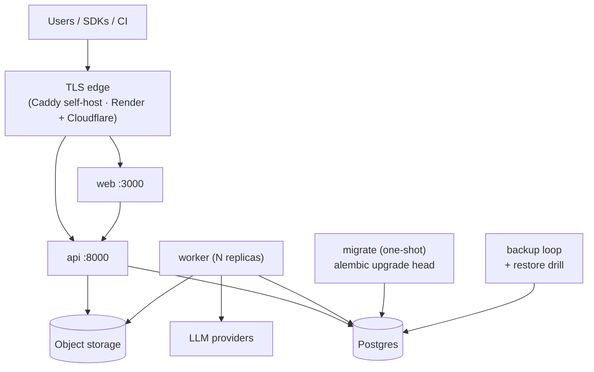

## Core concepts

| Concept | Meaning |
|---|---|
| **Trace / span** | One request through your app and the LLM, tool and retrieval calls inside it. |
| **Dataset** | A frozen, filtered, seeded sample of traces. Each item stores a *recording*: the LLM calls, the tool and retrieval events with their results, and the final output. |
| **Candidate** | A change to evaluate: provider/model, system prompt, prompt template, sampling params, retrieval `top_k`. Unset fields keep the recorded values, so an empty candidate is a faithful baseline. |
| **Judge** | An immutable, versioned grader (pass/fail, 1–5 rubric, or pairwise). Calibration against human labels is visible on every verdict. |
| **Experiment** | Dataset × baseline × candidate × judge × repeats. |
| **Verdict** | SAFE / UNSAFE / INCONCLUSIVE from a paired CI versus a non-inferiority margin (default δ = 5 points on a 0–100 scale). |

### Replay modes

| Mode | What runs | Can diverge? |
|---|---|---|
| `single_turn` (default) | Only the **final** LLM call, with recorded tool results and the candidate's overrides. Best for prompt and model changes. | Only on `unexpected_tool_call`. |
| `full_agent` | The whole agent loop. Each tool call the candidate makes is matched against the recording. Best when the change affects which tools get called. | Yes. No matching recording means `DIVERGED` at that step; the partial output is kept. |

### Tool-call matching (`full_agent`)

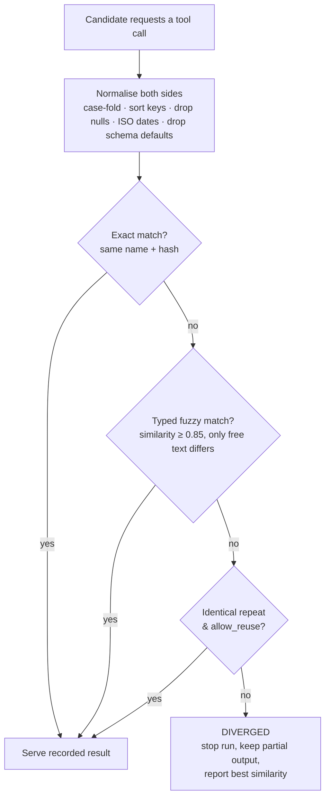

Divergence is never dropped silently. Reports show the divergence rate per arm, analyse completed runs
*and* diverged-as-worst, and refuse SAFE when candidate divergence exceeds 20% or the two analyses
disagree. Details: [docs/replay.md](docs/replay.md).

### How a verdict is decided

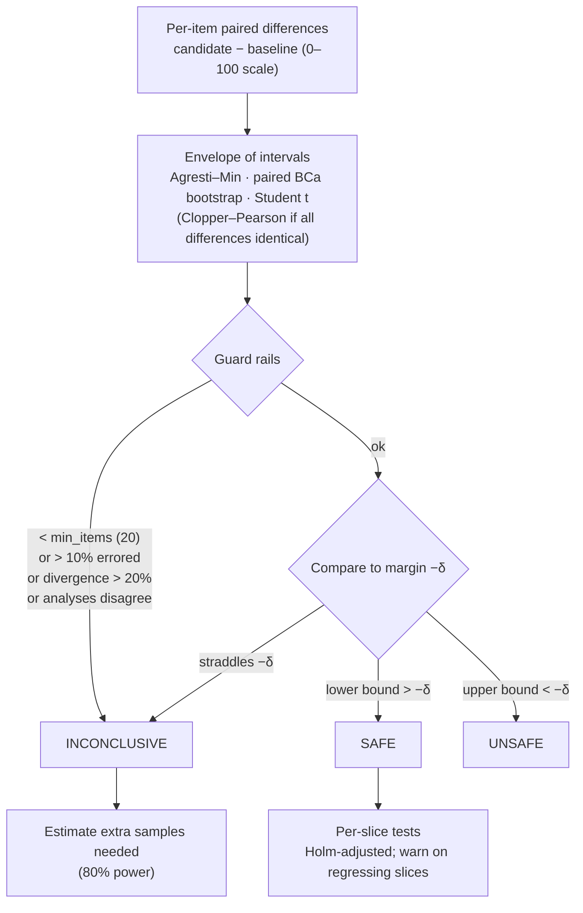

The false-SAFE rate at the margin is measured by simulation (2.6% for n=300 pass/fail against a 2.5%
nominal target) and asserted in CI. Full detail: [docs/statistics.md](docs/statistics.md).

## Run it locally

Requirements: Docker, [uv](https://docs.astral.sh/uv/), Node 20+.

```bash
docker compose up --build          # Postgres, S3 (SeaweedFS), migrations, API :8000, worker, dashboard :3000
uv sync                            # Python workspace for scripts and tests
uv run python scripts/seed_demo.py # demo workspace: traces, dataset, candidates, judges, 3 experiments
```

Open http://localhost:3000, use **Development sign-in** with the login `demo`, and open Experiments.
The demo uses the built-in *simulator* provider, so no LLM keys are needed. To use real models, add an
OpenAI or Anthropic key under Organization settings, then create candidates and judges that use them.

### Develop on the host (hot reload)

```bash
docker compose up -d postgres s3
cp .env.example .env               # defaults point at the containers above
uv run alembic -c backend/alembic.ini upgrade head
uv run uvicorn replay_api.app:app --reload --port 8000
uv run replay-worker
npm --prefix web install && npm --prefix web run dev
```

## Send your first trace

```python
import replay_sdk as replay
from openai import OpenAI

replay.init()                                # REPLAY_API_KEY, REPLAY_ENDPOINT
client = replay.wrap_openai(OpenAI())

@replay.tool()
def get_order(order_id: str) -> dict: ...

@replay.trace(tags=["support"], metadata={"route": "/support"})
def answer(question: str) -> str: ...
```

The SDK also provides `wrap_anthropic`, `retriever`, `span`, `prompt_variables`, `instrument`, `flush`
and `shutdown`. It has no dependencies and never blocks or raises in your request path.

Or POST JSON to `/v1/ingest`, or point any OpenTelemetry exporter at `/v1/otlp/v1/traces`. Accepted
formats: the SDK's own, OpenAI and Anthropic request/response shapes, OpenTelemetry GenAI conventions,
OpenLLMetry and OpenInference. The dashboard's Quickstart page has copy-paste versions with your key
filled in. Ingest format reference: [docs/api.md](docs/api.md).

## Gate pull requests in CI

```bash
pip install ./packages/cli
export REPLAY_API_KEY=rk_...       # project API key; never put it in replay.toml
replay init                        # writes an example replay.toml
replay check --base-ref origin/main
```

| Exit code | Meaning |
|---|---|
| 0 | Passed the policy, or skipped because no trigger path changed |
| 1 | Blocked by the policy (for example, the verdict is UNSAFE) |
| 2 | Error (configuration, network, timeout) |

In GitHub Actions, use the composite action in [`action/`](action/action.yml). It writes the verdict to
the job summary, posts or updates one PR comment, and sets the `verdict` and `experiment-url` outputs.
See [`examples/github-workflow.yml`](examples/github-workflow.yml) and
[docs/github-action.md](docs/github-action.md).

## Configuration

Backend settings come from environment variables (see [`.env.example`](.env.example)).

| Variable | Purpose |
|---|---|
| `ENV` | `development` / `staging` / `production`. Non-development startup refuses development secrets. |
| `DATABASE_URL` | `postgresql+asyncpg://…` as a **non-superuser** role, so RLS applies |
| `SESSION_SECRET`, `ENCRYPTION_KEY` | Session signing; wrapping key for provider-key envelope encryption |
| `PUBLIC_APP_URL`, `PUBLIC_API_URL` | Public hosts, used for redirects and CI links |
| `GITHUB_CLIENT_ID` / `_SECRET` | GitHub OAuth sign-in |
| `SIGNUP_MODE`, `SIGNUP_ALLOWLIST` | `open` locally; `allowlist` in production during the beta |
| `DEV_LOGIN_ENABLED` | Development sign-in (turn off in production) |
| `STORAGE_BACKEND`, `S3_*` | Object storage for large payloads |
| `ENABLE_SIMULATOR_PROVIDER` | Built-in deterministic models for demos and tests (off in production) |
| `LOG_JSON`, `LOG_LEVEL`, `SENTRY_DSN`, `METRICS_TOKEN` | Observability |

## Tests

```bash
uv run pytest backend packages -q            # ~250 tests; needs `docker compose up -d postgres`
uv run pytest packages/stats -m slow -q      # statistical simulations only
npm --prefix web run lint && npm --prefix web run build
```

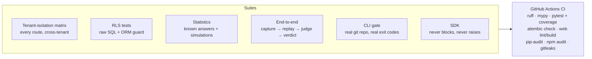

- A meta-test fails if a new API route has no tenant-isolation case.
- The statistics tests assert the false-SAFE rate and interval coverage with explicit tolerances, so a
  change that inflates the error rate fails CI.
- CI also verifies that migrations match the models (`alembic check`).

## Repository layout

| Path | What |
|---|---|
| `backend/` | FastAPI API, worker, replay engine, Alembic migrations (`replay-api`) |
| `packages/stats/` | Statistics library: intervals, tests, agreement, verdicts (`replay-stats`) |
| `packages/sdk-python/` | Python SDK, zero dependencies (`replay-sdk`) |
| `packages/cli/` | `replay` CLI / CI gate, standard library only (`replay-cli`) |
| `action/` | GitHub Action wrapping the CLI |
| `web/` | Next.js dashboard (App Router) |
| `spike/divergence/` | Phase 0.5 research spike and report |
| `deploy/` | Render Blueprint, self-host stack (Caddy), backups, smoke test, deploy hooks |
| `docs/` | Architecture, replay semantics, statistics, operations, security, launch checklist |
| `scripts/` | Demo seeding, load test |
| `examples/` | Example agent and GitHub workflow |
| `DECISIONS.md` | Architecture decision log (ADR-style, numbered) |

```
backend/src/replay_api/
  app.py / main.py   app factory, middleware (size limit, request id, security headers, metrics)
  deps.py            authentication (session / API key), CSRF, roles, tenant DB sessions
  db/                models, base, session (tenant scoping + RLS context)
  routers/           auth, orgs, projects, ingest (+OTLP), traces, datasets, judges, experiments, ci, health
  services/          ingest, otlp, redaction, storage, pricing, usage/quotas, audit, accounts,
                     datasets, experiments, calibration, llm
  replay/            canonical formats, recording builder, matching, providers, engine, judging
  security/          crypto, tokens, rate limiting, SSRF guard
  worker/            queue primitives, handlers, worker loop
```

## Deployment

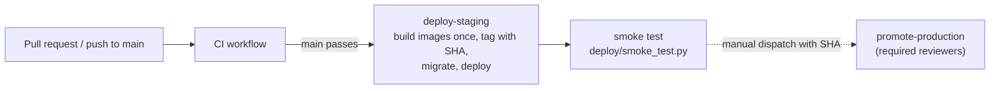

Artifacts are provider-agnostic: a Render Blueprint ([`deploy/render/`](deploy/render)), a single-host
self-hosting stack with Caddy HTTPS ([`deploy/selfhost/`](deploy/selfhost)), automated backups and a
restore drill ([`deploy/backup/`](deploy/backup)). See [docs/operations.md](docs/operations.md) and
[docs/self-hosting.md](docs/self-hosting.md).

## Security at a glance

- **Isolation:** app-layer org filter plus forced Postgres RLS; the app role has no BYPASSRLS.
- **Auth:** GitHub OAuth (state + PKCE), hashed server-side sessions, CSRF token + Origin check.
- **Keys:** API keys are 256-bit and stored as SHA-256 hashes. Provider keys use per-key envelope
  encryption (AES-256-GCM) and are crypto-shredded on revoke.
- **SSRF:** custom provider URLs must be public HTTPS hosts, re-checked before every call.
- **PII:** redaction before storage, fail-closed.
- **Supply chain:** lockfiles, Dependabot, pip-audit/npm audit, gitleaks, non-root containers.

Known gaps are listed openly in [docs/security.md](docs/security.md).

## Status

All six feature areas from the brief are built and tested:
- **Capture:** SDK, OTLP, redaction, retention.
- **Replay:** single-turn and full-agent modes, divergence handling, budgets, bring-your-own keys.
- **Judging:** judges, calibration, bias checks.
- **Statistics:** the stats library and verdict.
- **Dashboard:** all pages.
- **CI gate:** CLI and GitHub Action.

The Phase 0.5 divergence spike was run and its findings shipped; see
[`spike/divergence/REPORT.md`](spike/divergence/REPORT.md).

**Not live yet.** Going live needs accounts that only you can create: a hosting provider, a domain,
GitHub OAuth apps, an object-storage bucket and Sentry. The steps are in
[`docs/launch-checklist.md`](docs/launch-checklist.md). Everything else (CI/CD, Render Blueprint,
self-host stack, smoke tests, backups) is ready to use. No license has been chosen yet.

## Documentation

- [Architecture](docs/architecture.md)
- [Replay and divergence](docs/replay.md)
- [Statistics and verdicts](docs/statistics.md)
- [Operations](docs/operations.md): deploys, migrations, backups and restore, monitoring
- [Security](docs/security.md): controls and review checklist
- [Self-hosting](docs/self-hosting.md)
- [CI gate / GitHub Action](docs/github-action.md)
- [API overview](docs/api.md)
- [Launch checklist](docs/launch-checklist.md)
- [Decision log](DECISIONS.md)
